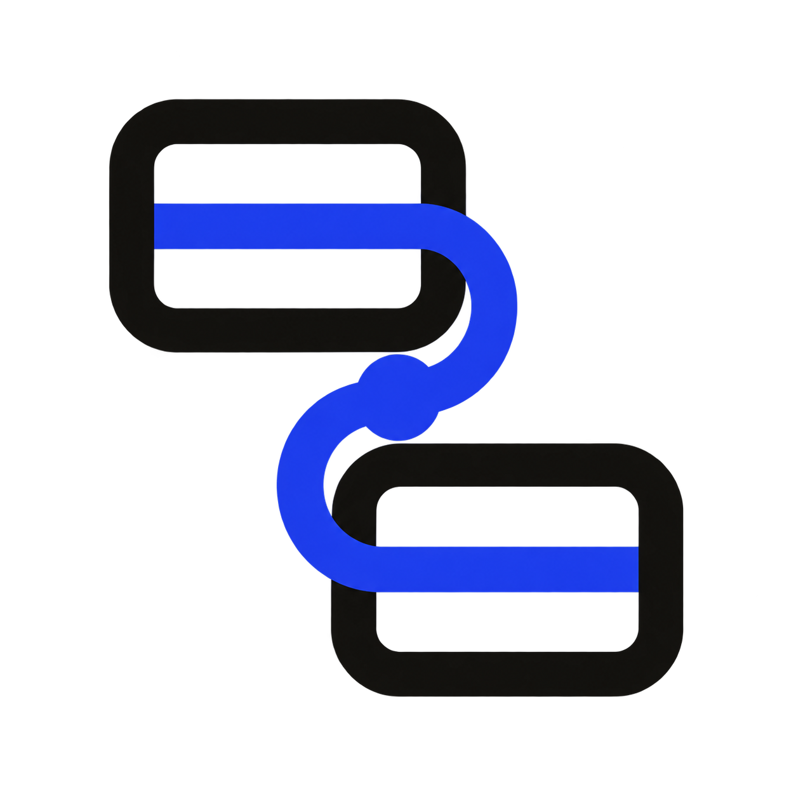

<p align="center">
  
</p>

<h1 align="center">Scenema</h1>

<p align="center">
  <strong>Durable choreography for real web applications.</strong>
  <br>
  Describe UI flows in execution order and keep them running across SPA and MPA navigation.
</p>

> **Early MVP:** Scenema is under active development. The operation protocol is implemented, but
> advanced workflow, branching, and serialization APIs are still being designed.

## Mental Model

```text
Scenario
└─ Step
   ├─ ready?              optional environment check
   ├─ cursor.move
   ├─ present
   ├─ click / type / press
   ├─ waitFor
   ├─ navigate
   └─ custom operation
```

Steps are logical choreography units, not pages or popups. A step can contain any number of
presentations and effects. Operations execute in the same order in which they are defined.

## Quick Start

```sh
git clone https://github.com/syi0808/scenema.git
cd scenema
pnpm install
pnpm dev
```

The landing page at `http://localhost:5173` runs real scenarios against its own controls.

## Define a Scenario

```ts
import { createTourPresenter } from "@scenema/presenter";
import { all, createScenema, defineScenario, pathname, step, visible } from "scenema";

const onboarding = defineScenario({
  id: "onboarding",
  version: 2,
  steps: [
    step("open-project", (s) => {
      s.cursor.move("#project");
      s.present({
        target: "#project",
        title: "Open this project",
      });
      s.navigate.click("#project");
    }),

    step(
      "project-detail",
      {
        ready: all(pathname(/^\/projects\//), visible("#project-detail")),
      },
      (s) => {
        s.present({
          target: "#project-title",
          title: "Project detail",
        });
        s.present({
          target: "#settings",
          title: "Open settings",
        });
        s.click("#settings");
      },
    ),

    step("edit-name", { ready: visible("#project-form") }, (s) => {
      s.present({ target: "#name", title: "Change the name" });
      s.type("#name", "Scenema");
      s.waitFor.value("#name", "Scenema");
    }),
  ],
});

const scenema = createScenema({
  scenarios: [onboarding],
  presenter: createTourPresenter(),
});

if (!(await scenema.bootstrap())) {
  await scenema.start("onboarding");
}
```

The builder callback runs once while the definition is created. It records operations; it is not an
async runtime callback. This keeps scenarios deterministic, inspectable, and resumable.

## Declarative Definitions

The builder produces the same structure accepted by the runtime directly:

```ts
const stepDefinition = {
  id: "project-name",
  operations: [
    { kind: "cursor.move", target: "#name" },
    {
      kind: "present",
      target: "#name",
      content: { title: "Choose a name" },
    },
    { kind: "type", target: "#name", value: "Scenema" },
    {
      kind: "wait",
      condition: { kind: "value", target: "#name", value: "Scenema" },
    },
  ],
};
```

Runtime scenarios may use selector strings, DOM `Node` objects, async target resolvers, predicate
readiness checks, and custom operations. A future serializable definition will be a restricted
subset rather than a constraint on the runtime model.

## Readiness

Scenema trusts the current application state unless a step declares `ready`. Built-in conditions
are composable:

```ts
step(
  "project-detail",
  {
    ready: all(pathname(/^\/projects\//), visible("#project-detail")),
  },
  (s) => {
    // Runs after both conditions are satisfied.
  },
);
```

Use `exists(target)` for DOM presence and `visible(target)` for presence, rendered visibility, and
non-empty geometry. Readiness also accepts synchronous or asynchronous observation predicates:

```ts
ready: async ({ document, location }) =>
  location.pathname.startsWith("/projects/") && document.querySelector("#project-detail") !== null;
```

## Progress and Back

Presenter progress counts presentations that require user advancement, not steps. Presentations
with `advance: "auto"` are excluded. `scenema.back()` moves to the previous user presentation
checkpoint without undoing application effects. Proceeding again skips operations already recorded
as complete, so clicks and other effects are not replayed.

## Durable Navigation

Use a normal action for an effect inside the current runtime lifetime:

```ts
s.click("#save");
```

Mark an action that may end the document or runtime lifetime explicitly:

```ts
s.navigate.click("#project-link");
```

Before navigation, Scenema writes a prepared operation checkpoint. SPA observation or a later MPA
`bootstrap()` advances to the following step, evaluates its `ready` condition, and resumes the same
session.

```text
checkpoint → perform → runtime may disappear → bootstrap → next Step ready → continue
```

Sessions use schema version 2 and semantic operation addresses such as `project-detail/3`:

```text
sessionStorage                      localStorage
active session id ────────────────→ __scenema__:v2:session:<id>
                                    stepId · operationIndex · completedOperations
```

## Custom Operations

Plugins extend the operation registry without modifying `StepBuilder`:

```ts
const scrolling = definePlugin({
  operations: {
    "scroll.to": {
      durability: "replay-safe",
      async execute(operation, context) {
        const target = await context.resolveTarget(operation.target);
        // Execute the custom behavior.
      },
    },
  },
});

step("pricing", (s) => {
  s.use({ kind: "scroll.to", target: "#pricing" });
  s.present({ target: "#pricing", title: "Pricing" });
});

createScenema({
  scenarios: [scenario],
  plugins: [scrolling],
  presenter: createTourPresenter(),
});
```

Operation handlers declare `replay-safe`, `at-most-once`, or `reconcile` durability. Built-in
cursor, presentation, wait, action, and navigation operations apply their corresponding checkpoint
rules automatically.

## Packages

| Package                | Responsibility                                                   |
| ---------------------- | ---------------------------------------------------------------- |
| `@scenema/core`        | Operation DSL, validation, v2 sessions, and durable runtime      |
| `@scenema/runtime-web` | DOM target resolution, conditions, storage, navigation observers |
| `@scenema/presenter`   | Accessible Shadow DOM tour presenter                             |
| `scenema`              | Actorble-backed facade, registry, bootstrap, and plugin wiring   |

## Development

```sh
pnpm typecheck
pnpm test
pnpm lint
pnpm build:site
```

## Current Scope

Implemented:

- Flat ordered steps and programmatic/declarative operations
- Multiple presentations per step with checkpoint-based progress and back navigation
- CSS selector, DOM `Node`, and target resolver support
- Composable readiness and wait conditions
- Durable same-origin SPA and MPA navigation
- V2 local persistence and automatic bootstrap reconciliation
- Custom operation registration through plugins

Future design work includes exact Node geometry rules, navigation crash protocols, branching,
dynamic workflows, a serializable subset, and presenter customization.

## Design Principle

> **Persist → Perform → Reconcile**

Scenema expresses UI choreography as a sequence and preserves that sequence across browser
lifetimes.
